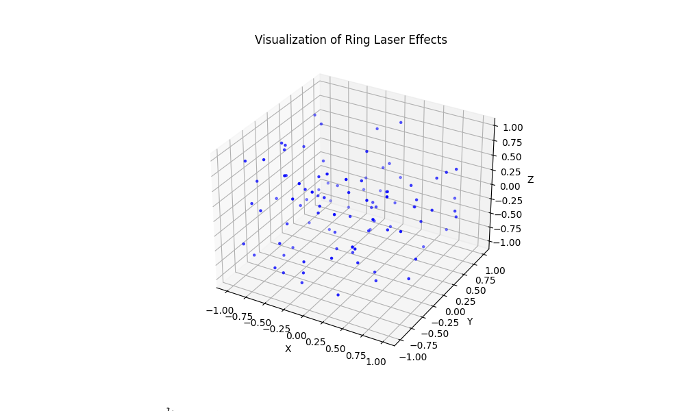

# Ring Laser Experiment Simulator

## Overview
This advanced version of the Ring Laser Experiment Simulator features a graphical user interface (GUI) developed with wxPython, providing interactive controls for adjusting experimental parameters. It simulates gravitational effects such as frame dragging and time dilation on a ring laser setup and offers 3D visualization of these effects.
______________________________________________________________________________
 
______________________________________________________________________________

## Requirements
- Python 3.x
- numpy
- matplotlib
- wxPython
- pandas
- scipy

## Installation
Clone or download the repository and install the required dependencies.
```bash
pip install numpy matplotlib wxPython pandas scipy
```

## Usage
Run the script to start the simulation.
```bash
python TRL.py
```

## Components
### RingLaserExperiment Class
- `__init__(laser_power, laser_radius)`: Initializes the experiment with specified laser power and radius settings.
- `simulate_experiment()`: Simulates the experiment and calculates relevant gravitational metrics.

### MainFrame Class (GUI Component)
- Initializes the application window and interactive sliders for real-time parameter adjustments.
- `update_experiment()`: Captures slider inputs, updates experiment parameters, and recalculates results.
- `update_plot()`: Redraws the 3D scatter plot to visualize updated results.

## Visualization and Data Output
The results are visualized using a 3D scatter plot, and data metrics are saved in CSV files. Below are links to the output files, which include detailed data metrics:

### Notebook Visualization of Ring Laser Effects


### Notebook Data Metrics Output
-----------------------
#### Standard Deviation
[Standard Deviation](https://github.com/HermiTech-LLC/Time-Ring/blob/main/standard_deviation_metrics.csv)
#### Skewness
[Skewness](https://github.com/HermiTech-LLC/Time-Ring/blob/main/skewness_metrics.csv)
#### Kurtosis
[Kurtosis](https://github.com/HermiTech-LLC/Time-Ring/blob/main/kurtosis_metrics.csv)
#### Correlation Coefficients
[Correlation Coefficients](https://github.com/HermiTech-LLC/Time-Ring/blob/main/correlation_coefficients_metrics.csv)

## Example Script Code
```python
if __name__ == "__main__":
    app = wx.App(False)
    frame = MainFrame()
    frame.Show()
    app.MainLoop()
```

## License
This project is licensed under the GNU General Public License v3.0 - see the LICENSE file for details.
